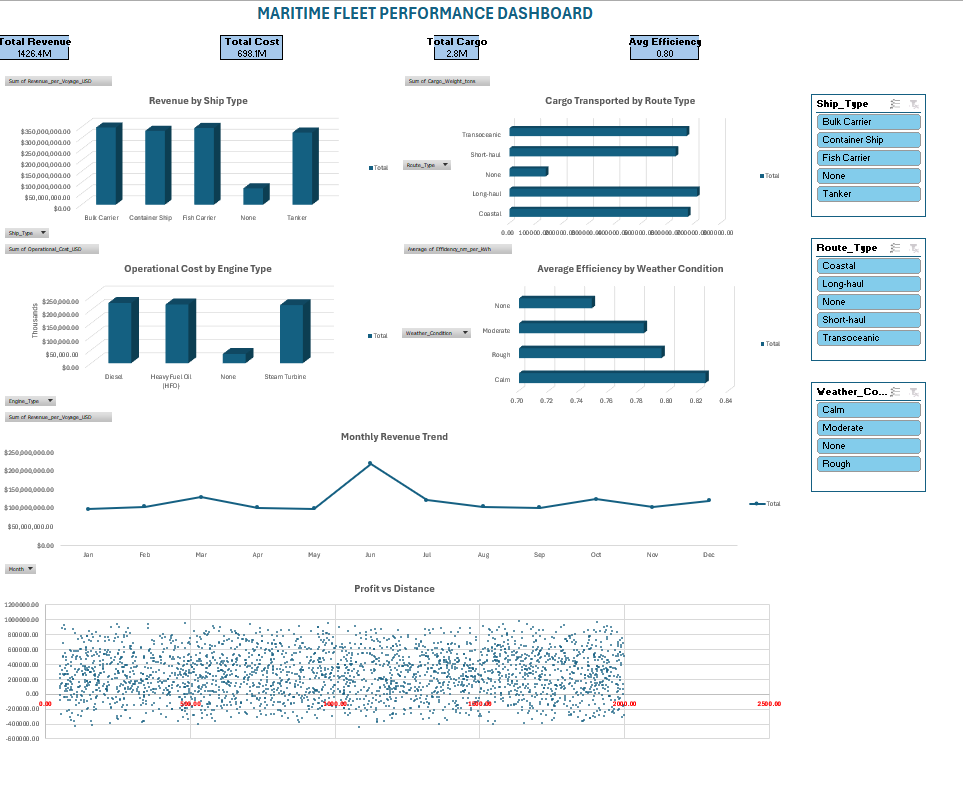

# 🚢 Maritime Fleet Analytics Dashboard

## 📌 Business Problem

Fleet operations generate large volumes of trip and scheduling data.
Without structured analysis, companies struggle to monitor:

* Route performance
* Driver utilisation
* Monthly trip trends
* Operational efficiency

This project demonstrates how Excel analytics dashboards can support **data-driven fleet management decisions.**

---

## 📊 Executive Dashboard Preview



📂 **Open Interactive Dashboard (Excel File):**  
👉 [Click here to view or download the Maritime Fleet Dashboard](Maritime_Fleet_Analytics.xlsx)
---

## ⚙️ Tools & Techniques Used

### Data Preparation

* Data cleaning using Excel
* Structured dataset formatting
* Trip scheduling categorisation

### Data Analysis

* Pivot Tables for summarising fleet trips
* KPI calculations (Total Trips, Route Frequency, Monthly Trend)
* Driver performance comparison

### Data Visualisation

* Interactive charts
* Slicers for driver and month filtering
* Dashboard layout for executive reporting

---

## 📈 Key Performance Indicators (KPIs)

* Total Trips Completed
* Trips by Month Trend
* Top Route Frequency
* Driver Schedule Distribution
* Fleet Utilisation Insights

---

## 💡 Key Insights

* Certain routes contribute significantly higher trip frequency
* Monthly trends reveal peak operational periods
* Dashboard filtering allows management to evaluate driver schedules efficiently

---

## 🎯 Business Value

This dashboard enables:

1. Better fleet planning
2. Improved route allocation
3. Monitoring driver workload
4. Data-supported operational decision making

---

## 📂 Repository Structure

```
maritime-fleet-analytics/
│
├── Maritime_Fleet_Analytics.xlsx
├── Maritime_Fleet_Dashboard.png
└── README.md
```

---

## 🚀 Future Improvements

* Convert dashboard into Tableau version
* Add SQL database integration
* Introduce predictive trip demand analysis

---

## 👤 Author

Muhammad Syakir
Aspiring Data Analyst
